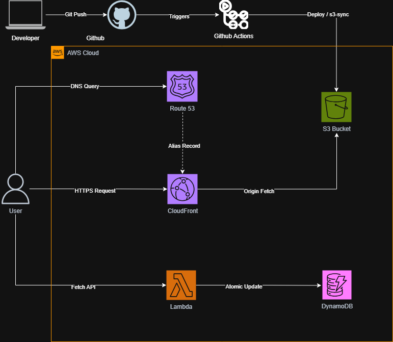

# Tunahan Avcu - Personal Portfolio


This project is a modern personal portfolio website built with **cloud-native technologies**. It features static site hosting, a serverless backend architecture, and a fully automated CI/CD pipeline.

🔗 **Live Site:** [https://alitunahanavcu.com](https://alitunahanavcu.com)

---

## 🏗️ Cloud Architecture

Below is the architectural diagram showing the data flow from the client to the serverless backend.




---

## 🚀 Tech Stack

The project utilizes the following technologies and architectural patterns:

### Frontend
* **Pug (Jade):** HTML templating engine.
* **SCSS/SASS:** Modern CSS preprocessor.
* **JavaScript (ES6+):** Dynamic content management.
* **Start Bootstrap Resume:** Base design framework.

### Backend & Cloud (AWS) ☁️
* **AWS Lambda (Python):** Serverless backend function for the visitor counter.
* **AWS DynamoDB:** NoSQL database storing visitor data (Atomic Counters & TTL).
* **AWS Function URL:** Lightweight endpoint structure replacing API Gateway.
* **AWS S3:** Static asset hosting (HTML, CSS, JS, Images).

### DevOps & CI/CD ⚙️
* **GitHub Actions:** Automation pipeline triggered on push to `main`.
* **Automated Build:** Compiles `Pug` to HTML and `SCSS` to CSS.
* **Secret Injection:** Securely injects API endpoints during build time.
* **S3 Sync:** Seamless deployment using `s3-sync`.

---

## 🛠️ Installation & Development

To run the project locally on your machine:

1.  **Clone the repository**
    ```bash
    git clone [https://github.com/avcalitunahan/tunahan-portfolio.git](https://github.com/avcalitunahan/tunahan-portfolio.git)
    ```

2.  **Navigate to the directory**
    ```bash
    cd tunahan-portfolio
    ```

3.  **Install dependencies**
    ```bash
    npm install
    ```

4.  **Start development server** (Builds assets and watches for changes)
    ```bash
    npm start
    ```

---
*Developed by Ali Tunahan Avcu*